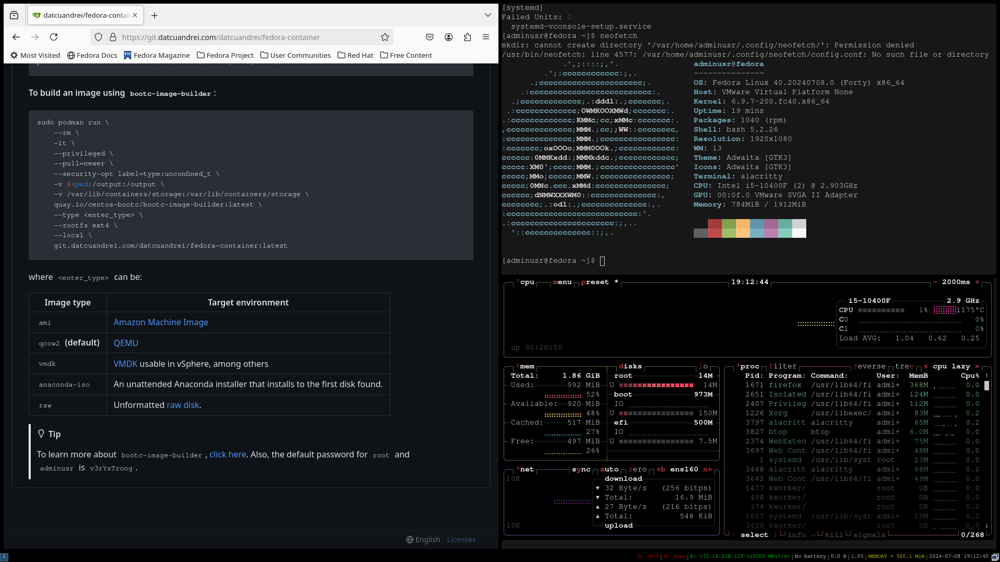

# fedora-container

bootc compatible template for myself. 

> `fedora-bootc:40` built container running in VMware Fusion.
## Deployment
First we need to start the Podman machine in rootful mode:
```bash
podman machine stop
podman machine set --rootful
podman machine start
```

Next we can build the container itself:
```bash
podman build . # assuming you are in the project's directory
```

And then simply run the container:
```bash
podman run -dit <container_id>
```
By default, the entrypoint is `bash`. And as such, the container won't stop unless you explicitly do so. To interact with it:
```bash
podman exec -it <container> /bin/bash # or anything else; this will start a shell
```

**To build an image using `bootc-image-builder`**:
```bash
sudo podman run \
    --rm \
    -it \
    --privileged \
    --pull=newer \
    --security-opt label=type:unconfined_t \
    -v $(pwd)/output:/output \
    -v /var/lib/containers/storage:/var/lib/containers/storage \
    quay.io/centos-bootc/bootc-image-builder:latest \
    --type vmdk \
    --rootfs ext4 \
    --local \
    replace-image:tag
```
I mainly use `vmdk` for my image output for VMware Fusion, but there are different outputs to choose from: 
| Image type            | Target environment                                                                    |
|-----------------------|---------------------------------------------------------------------------------------|
| `ami`                 | [Amazon Machine Image](https://docs.aws.amazon.com/AWSEC2/latest/UserGuide/AMIs.html) |
| `qcow2` | [QEMU](https://www.qemu.org/)                                                         |
| `vmdk` **(default)**  | [VMDK](https://en.wikipedia.org/wiki/VMDK) usable in vSphere, among others            |
| `anaconda-iso`        | An unattended Anaconda installer that installs to the first disk found.               |
| `raw`                 | Unformatted [raw disk](https://en.wikipedia.org/wiki/Rawdisk).         

For `rootfs`, currently only `ext4` and `xfs` are supported.

> [!TIP]
> To learn more about `bootc-image-builder`, [click here](https://github.com/osbuild/bootc-image-builder/blob/main/README.md). <br/>
> The default password for `root` and `adminusr` is `v3rYsTrong`. <br/>
> Make sure to create an `output` folder before building an image.

## LICENSE
```
MIT License

Copyright (c) 2024 datcuandrei

Permission is hereby granted, free of charge, to any person obtaining a copy 
of this software and associated documentation files (the "Software"), to deal 
in the Software without restriction, including without limitation the rights 
to use, copy, modify, merge, publish, distribute, sublicense, and/or sell 
copies of the Software, and to permit persons to whom the Software is 
furnished to do so, subject to the following conditions:

The above copyright notice and this permission notice shall be included in 
all copies or substantial portions of the Software.

THE SOFTWARE IS PROVIDED "AS IS", WITHOUT WARRANTY OF ANY KIND, EXPRESS OR 
IMPLIED, INCLUDING BUT NOT LIMITED TO THE WARRANTIES OF MERCHANTABILITY, 
FITNESS FOR A PARTICULAR PURPOSE AND NONINFRINGEMENT. IN NO EVENT SHALL THE 
AUTHORS OR COPYRIGHT HOLDERS BE LIABLE FOR ANY CLAIM, DAMAGES OR OTHER 
LIABILITY, WHETHER IN AN ACTION OF CONTRACT, TORT OR OTHERWISE, ARISING FROM,
OUT OF OR IN CONNECTION WITH THE SOFTWARE OR THE USE OR OTHER DEALINGS IN THE 
SOFTWARE.
```